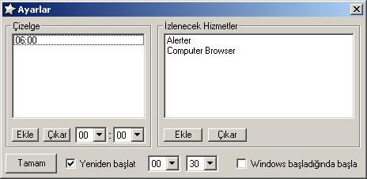



## Server Guard

### Description

Hi all. This is a very simple but effective application to keep servers up. This is coded for server systems running on ordinary PCs. Checks selected services in a schedule and restarts them if necessary. And also restarts the server in a given time. I used someone elses code pieces here from psc but cant remember authors names. I wrote this code 3 yrs before. So please forgive me.. And also wanna thank to everybody who share codes especially owner of the class that I used.. Enjoy... (By the way its in Turkish so here is the pocket dictionary: &#199;izelge--&gt;Schedule, &#221;zlenecek Hizmetler--&gt;Services to watch, Ekle--&gt;Add, &#199;&#253;kar--&gt;Remove, Yeniden Ba&#254;lat--&gt;Restart, Windows ba&#254;lad&#253;&#240;&#253;nda ba&#254;la--&gt;Start when Windows starts, Tamam--&gt;OK)
 
### More Info
 

             |
---                |---
**Submitted On**   |2007-04-18 17:14:58
**By**             |[KeleBack](https://github.com/Planet-Source-Code/PSCIndex/blob/master/ByAuthor/keleback.md)
**Level**          |Intermediate
**User Rating**    |5.0 (10 globes from 2 users)
**Compatibility**  |VB 5\.0, VB 6\.0
**Category**       |[Complete Applications](https://github.com/Planet-Source-Code/PSCIndex/blob/master/ByCategory/complete-applications__1-27.md)
**World**          |[Visual Basic](https://github.com/Planet-Source-Code/PSCIndex/blob/master/ByWorld/visual-basic.md)
**Archive File**   |[Server\_Gua2061034182007\.zip](https://github.com/Planet-Source-Code/keleback-server-guard__1-68389/archive/master.zip)

